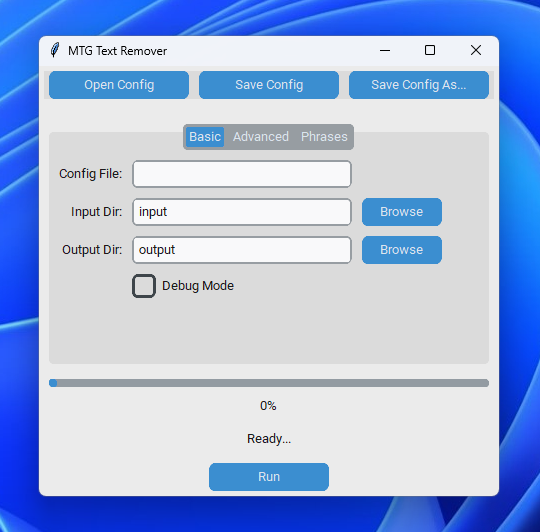

# MTGTextRemover

Removes specific text (e.g., watermark phrases) from Magic: The Gathering card images. Uses Tesseract OCR to detect targeted words or phrases and OpenCV inpainting to remove them.



## Features
- Detects user-defined text via Tesseract.
- Configurable bounding box padding, dilation, and inpainting parameters.
- Supports multi-word phrases.
- Preserves or changes the image extension as needed.
- Offers a GUI (using CustomTkinter) for non-technical users.

## Requirements
- Python 3.8+
- [Tesseract](https://tesseract-ocr.github.io/tessdoc/) installed system-wide or specify a custom path.
- Python packages:
  - `opencv-python`
  - `pytesseract`
  - `PyYAML`
  - `customtkinter` (for the GUI)

## Installation
1. Install Tesseract (via your OS package manager or official sources).
2. Clone or download this repository.
3. Install Python dependencies:
   ```bash
   pip install opencv-python pytesseract PyYAML customtkinter
   ```

## Usage (GUI)
1. Run the `gui.py` script:
   ```bash
   python gui.py
   ```
2. Click **Open Config** to load a YAML file (optional).
3. Set input/output directories, text phrases, and inpainting settings.
4. Click **Run** to process images.

## Usage (CLI)
If you have a CLI version (e.g., `main.py`):
1. Edit or use default config (`config.yaml`).
2. Run:
   ```bash
   python main.py --config-file config.yaml
   ```
3. Images are read from the specified input folder and saved to the output folder.

## Configuration
A YAML config can include phrases, bounding box parameters, inpainting radius and method, Tesseract path, and more. See `config.yaml` as an example.

---

**Disclaimer**  
This software is for personal use and made with ChatGPT. Use at your own risk.
